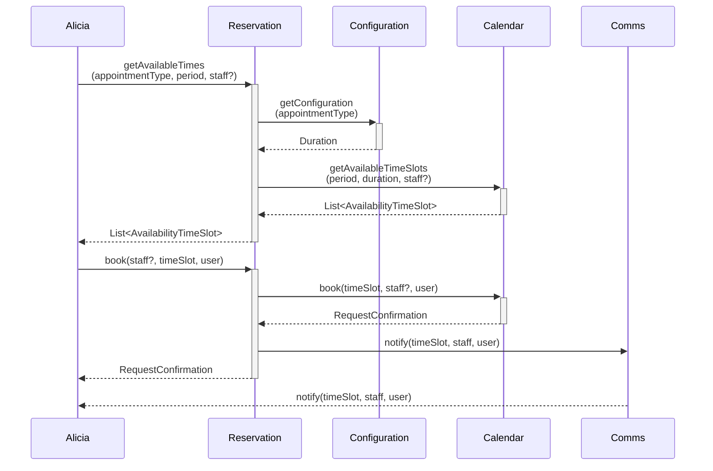
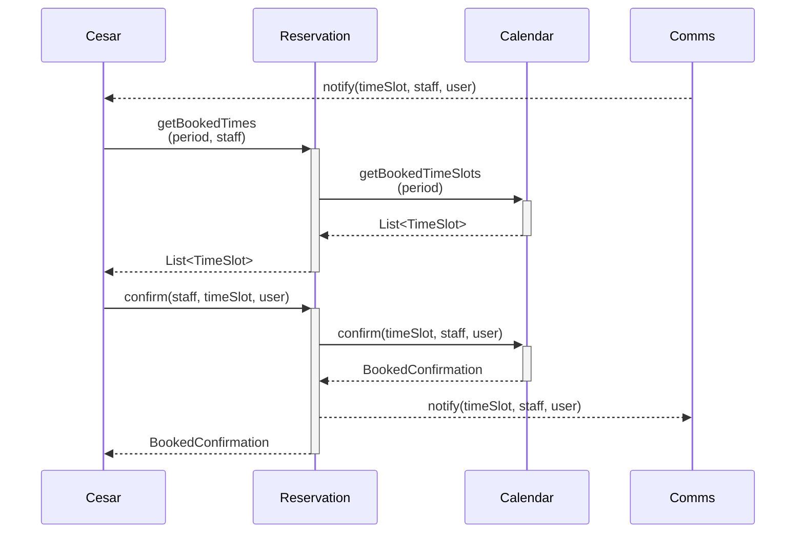

# Alpaca Scheduler Back-End

## Getting Started
1. Download Docker on your machine. We use [Docker Desktop](https://www.docker.com/products/docker-desktop/)
   - If you are unable to launch Docker Desktop when on Ubuntu 24.04, try the following:
   https://forums.docker.com/t/docker-desktop-not-working-on-ubuntu-24-04/141054/2
2. For Windows, you will need to edit some setting in Docker Desktop
   1. Open Setting > General
   2. Check `Expose daemon on tcp://localhost:2375 without TLS`
   3. Check `Add the *.docker.internal names to the host's /etc/hosts file (Requires password)`
   4. Apply and restart. This is important given supabase isn't fully compatible with Windows
3. Follow the steps [here](https://supabase.com/docs/guides/cli/getting-started) to install a local supabase instance.
4. Once you've installed supabase, `cd MonoRepo/alpaca-scheduler` and enter `supabase start` . This will be used for local development.

### Ubuntu Work Around for Docker Desktop
```bash
sudo sysctl -w kernel.apparmor_restrict_unprivileged_userns=0
sudo systemctl --user restart docker-desktop
```

## Sequence Diagram
Here is a simple flow chart:



Test

