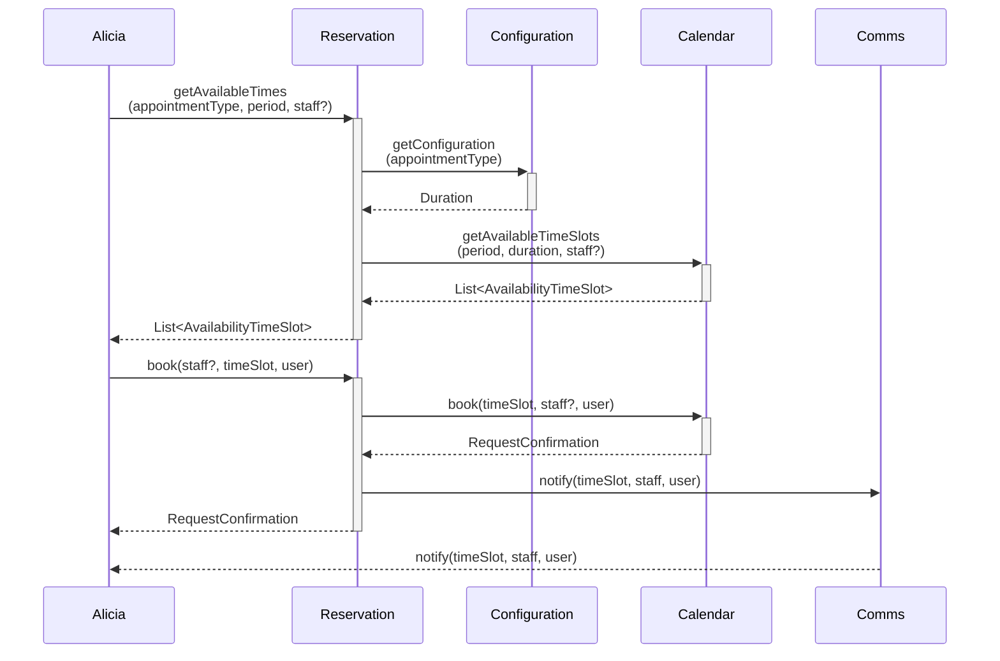
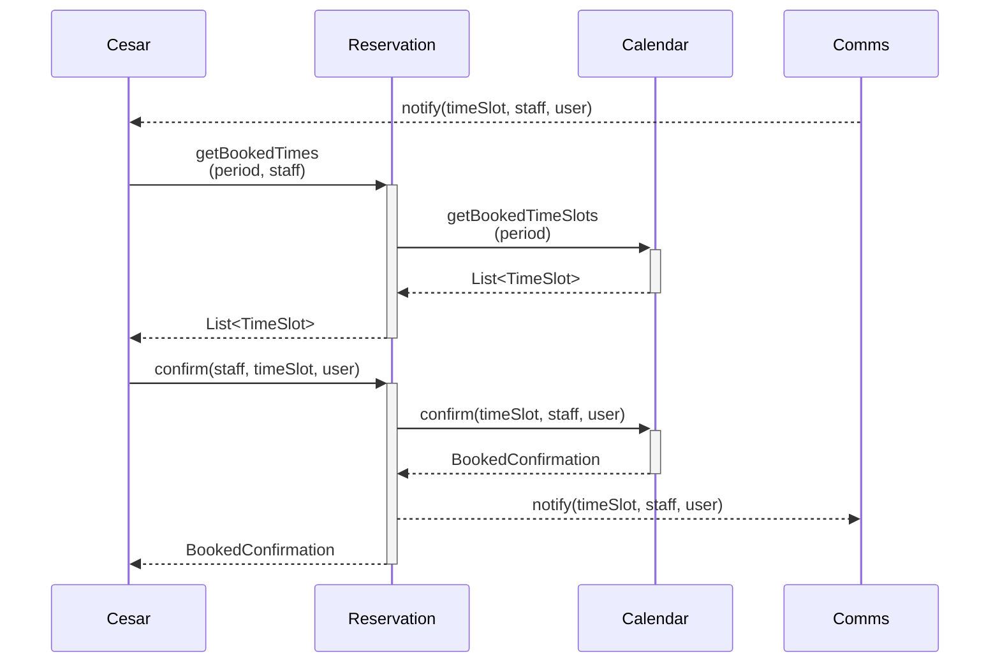

# Alpaca Scheduler Back-End

## Getting Started

Follow the steps [here](https://supabase.com/docs/guides/cli/local-development) to install a local supabase instance. 
This will be used for local development.

If you are unable to launch Docker Desktop when on Ubuntu 24.04, try the following:
https://forums.docker.com/t/docker-desktop-not-working-on-ubuntu-24-04/141054/2

```bash
sudo sysctl -w kernel.apparmor_restrict_unprivileged_userns=0
sudo systemctl --user restart docker-desktop
```
Here is a simple flow chart:



Test

