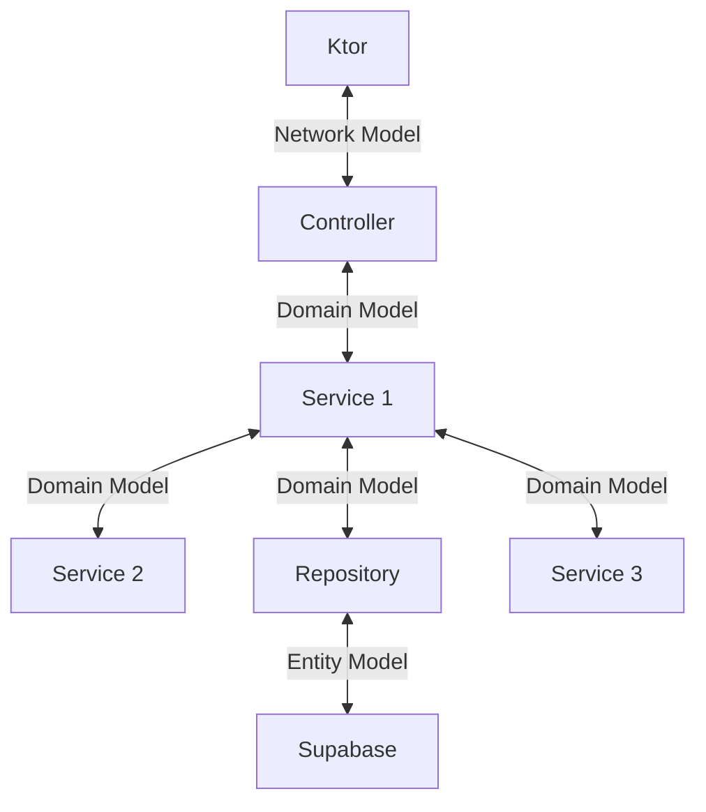

# Architecture

This document will go over the high level architecture of the Alpaca Scheduler project. 

I will declare some caveats before we begin:
- Network Model: This is the model that is used to interact with the client. These classes are tagged with the [NetworkModel](../../../../../../../../../shared/src/commonMain/kotlin/com/codehavenx/alpaca/shared/api/annotations/NetworkModel.kt)
annotation. They are usually suffixed with `Request` or `Response` to denote their purpose. You can find the model in the [shared](../../../../../../../../../shared/src/commonMain/kotlin/com/codehavenx/alpaca/shared/api/model) module.
- Domain Model: This is the main data classes to be used within the service layer. They do not have a specific annotation. We want to 
use these models as much as possible to avoid coupling our business logic to the network or database models. You can find the model in the [service](service/models) module.
- Entity Model: This is the model that is used to interact with the database. These classes are tagged with an annotation that is specific to the database. 
For example our Supabase models can be found in the [models](repository/supabase/models) folder and they are tagged with [SupabaseModel](repository/supabase/SupabaseModel.kt).

The project is split into the following components:

## Controller
Controllers are responsible for handling incoming requests and returning responses to the client. They are the entry
point for the application and are responsible for routing requests to the appropriate service.

Controllers do no perform business logic, their purpose is to perform input and output validation. They input and output
[Network models](../../../../../../../../../shared/src/commonMain/kotlin/com/codehavenx/alpaca/shared/api/model). 
Controllers do not have dependencies other than the service layer.

## Service
Services are responsible for performing business logic. They are the core of the application and are responsible for
interacting with the database, other services, and external APIs. 

Services input and output [Domain models](service/models), this is a core-concept as we do not want to couple our 
business logic to network or database models. 

## Repository
Repositories are responsible for interacting with the database. These classes input domain models but it will internally
use repository models to interact with the database.

The repositories will be defined using an interface in the [repository](repository) folder and there will be an 
implementation in a separate folder. Repositories do not have dependencies other than the database.

