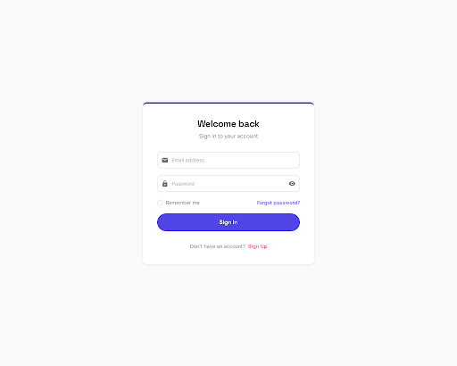
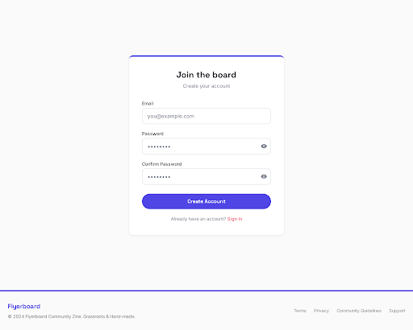
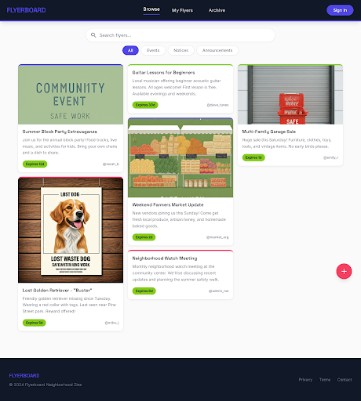
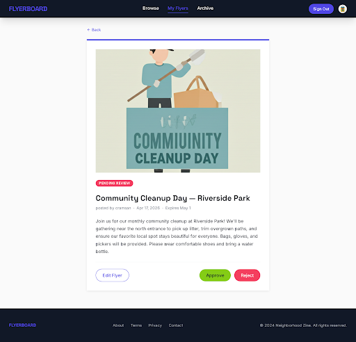
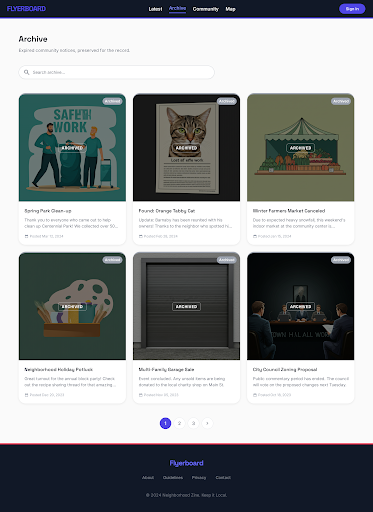
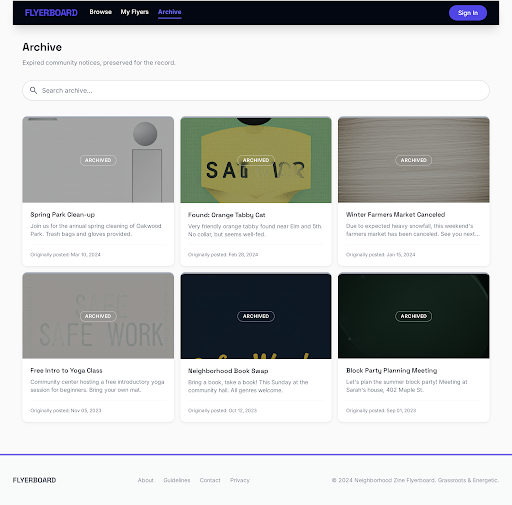
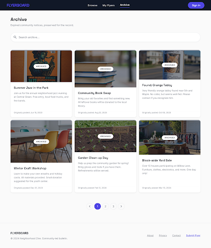
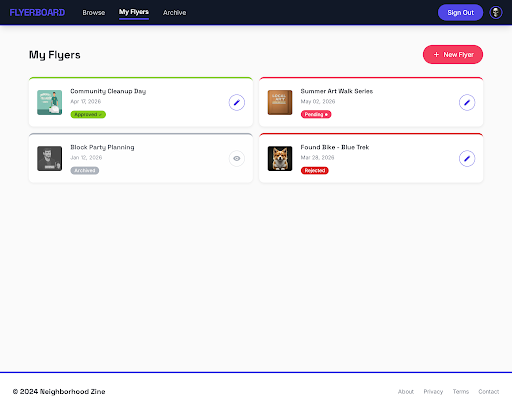
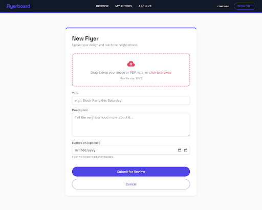
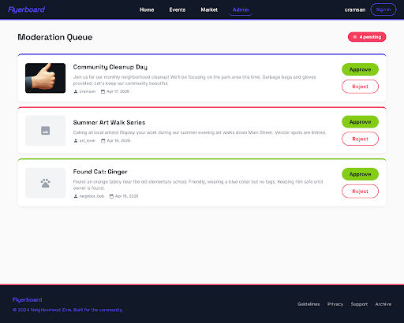

# FlyerBoard Front-End

## Overview

FlyerBoard is a Compose Multiplatform web application that lets the community browse, submit, and moderate event flyers. The app targets desktop web (WASM), Android, and JVM Desktop from a single shared codebase.

**UI mocks (Stitch):** https://stitch.withgoogle.com/projects/10770105419975055856

---

## Design System

The visual theme is **Neighborhood Zine** — bold, energetic, grassroots — inspired by hand-made flyers and community art.

| Token | Value |
|---|---|
| Primary (Electric Indigo) | `#4F46E5` |
| Secondary (Hot Coral) | `#F43F5E` |
| Accent (Lime) | `#84CC16` |
| Background | `#FAFAFA` |
| Surface | `#FFFFFF` |
| Text primary | `#111827` |
| Text muted | `#6B7280` |
| Nav bar | `#111827` |

**Typography:** Headlines use Space Grotesk (bold); body, labels, and UI copy use Inter.

**Cards:** 12 px radius, white background, `0 2px 8px rgba(0,0,0,0.08)` shadow, 4 px colored top-border accent cycling through Indigo / Coral / Lime.

**Buttons:** Primary = filled Indigo pill; Secondary = filled Coral pill; Ghost = Indigo outline; Danger = Hot Coral; Success = Lime.

**Status badges:**

| Status | Background | Text |
|---|---|---|
| Approved | Lime `#84CC16` | Near-black |
| Pending | Coral `#F43F5E` | White |
| Rejected | Red `#DC2626` | White |
| Archived | Grey `#9CA3AF` | White |

---

## App Navigation Flow

The app has three navigation layers: a **window layer** that owns the top-level graph stack, a **graph layer** (Splash / Auth / Main), and a **screen layer** within each graph.

```
Window
├── SplashGraph
│   └── SplashScreen  ───────────────────────────────► MainGraph
│
├── AuthGraph
│   ├── SignInScreen  ──── "Create Account" ──────────► SignUpScreen
│   │                 ──── sign-in success ────────────► MainGraph (clear stack)
│   └── SignUpScreen  ──── sign-up success ────────────► MainGraph (clear stack)
│                     ──── back ───────────────────────► SignInScreen
│
└── MainGraph
    │
    ├── [Bottom nav]
    │   ├── 🏠  FlyerListScreen          (start destination)
    │   ├── 📦  ArchiveScreen
    │   ├── 👤  MyFlyersScreen           (requires auth → AuthGraph if not signed in)
    │   └── ⚖️  ModerationQueueScreen    (requires auth + admin role)
    │
    ├── FlyerListScreen  ──── tap card ─────────────────► FlyerDetailScreen
    │                    ──── "Sign In" ─────────────────► AuthGraph
    │
    ├── FlyerDetailScreen ─── back ──────────────────────► (previous screen)
    │
    ├── ArchiveScreen ──────── tap card ─────────────────► FlyerDetailScreen
    │
    ├── MyFlyersScreen ──────── tap card ───────────────► FlyerDetailScreen
    │                  ──────── "Edit" ─────────────────► FlyerEditScreen
    │                  ──────── "Submit" ───────────────► FlyerSubmitScreen (New Flyer)
    │
    ├── FlyerEditScreen ──────── save success ──────────► back
    │
    └── ModerationQueueScreen ── approve / reject ───────► (refreshes in place)
```

---

## Screens

### 1. Splash

**Route:** `SplashNavGraphDestination`

The launch screen shown while the app initialises. Displays the wordmark and a loading indicator, then automatically advances to the Main graph after one second.


**User actions:** None — fully automatic.

---

### 2. Sign In

**Route:** `AuthDestination.SignInDestination`

Lets an existing user authenticate with email and password. On success the auth graph is replaced by the main graph (full stack clear). Failed attempts surface a snackbar error without clearing the form.



**User actions:**
- Enter email and password
- **Sign In** → `AuthService.signIn(email, password)` → navigates to Main graph
- **Create Account** → navigates to Sign Up screen

---

### 3. Sign Up

**Route:** `AuthDestination.SignUpDestination`

Registers a new Supabase Auth account. On success the user lands directly in the main app. The email/password pair is validated client-side before submission.



**User actions:**
- Enter email and password
- **Sign Up** → `AuthService.signUp(email, password)` → navigates to Main graph
- **Back to Sign In** → navigates back

---

### 4. Flyer List (Public Feed)

**Route:** `MainDestination.FlyerListDestination` — start destination of the Main graph

The home screen. Publicly accessible. Shows a paginated grid of approved flyers. The top-right header toggles between **Sign In** (unauthenticated) and **Sign Out** (authenticated) and shows a **Submit** button when the user is signed in.



**User actions:**
- **Tap flyer card** → Flyer Detail screen
- **Refresh** (icon button) → reloads feed
- **Sign In** (header, unauthenticated only) → Auth graph
- **Sign Out** (header, authenticated only) → clears session, stays on screen
- **Submit** (authenticated only) → Submit Flyer screen

**API:** `GET /api/v1/flyers` (public)

---

### 5. Flyer Detail

**Route:** `MainDestination.FlyerDetailDestination(flyerId)`

Full-page view of a single flyer. Shows the flyer image (4:3 aspect ratio), title, full description, and expiration date. Reachable from the public feed, the archive, and My Flyers.



**User actions:**
- **Back** → returns to the previous screen

**API:** `GET /api/v1/flyers/{id}` (public)

---

### 6. Archive

**Route:** `MainDestination.ArchiveDestination`

Publicly browsable list of flyers whose event date has passed. Supports full-text search (same `q` parameter exposed in the back-end). Layout and card style mirror the public feed.







**User actions:**
- **Search bar** → filters results via `q` query parameter
- **Tap flyer card** → Flyer Detail screen
- **Refresh** → reloads archive
- **Sign In / Sign Out** (header) → same behaviour as public feed

**API:** `GET /api/v1/flyers/archive?q=...` (public)

---

### 7. My Flyers

**Route:** `MainDestination.MyFlyersDestination` — requires authentication

Shows all flyers submitted by the authenticated user across all statuses. Each card carries a colour-coded status badge (Approved / Pending / Rejected / Archived). Non-archived flyers have an **Edit** action.



**User actions:**
- **Tap flyer card** → Flyer Detail screen
- **Edit** (on pending/approved/rejected flyers) → Flyer Edit screen
- **Refresh** → reloads list
- **Sign Out** → clears session, returns to Main graph
- **Submit new flyer** (header button) → Submit Flyer screen

**API:** `GET /api/v1/flyers/mine` (authenticated)

---

### 8. Submit Flyer

**Route:** `MainDestination.FlyerSubmitDestination` — requires authentication

Form for submitting a new flyer. Accepts a title, description, optional event/expiry date, and the flyer file (JPEG, PNG, WebP, or PDF up to 10 MB). On submit the flyer enters the **Pending** queue awaiting admin approval.



**Fields:**
| Field | Required | Notes |
|---|---|---|
| Title | Yes | Max 200 characters |
| Description | Yes | Max 2 000 characters |
| Event / Expiry date | No | ISO-8601; flyer archives automatically after this date |
| File | Yes | JPEG, PNG, WebP, or PDF; max 10 MB |

**User actions:**
- **Submit** → `POST /api/v1/flyers` (multipart); on success navigates back to My Flyers
- **Cancel / Back** → discards form, navigates back

**API:** `POST /api/v1/flyers` (authenticated)

---

### 9. Edit Flyer

**Route:** `MainDestination.FlyerEditDestination(flyerId)` — requires authentication and ownership

Allows the uploader to update the title, description, expiry date, or replace the file. Saving resets the flyer to **Pending** and triggers re-moderation.

**User actions:**
- Edit any field
- **Save** → `PUT /api/v1/flyers/{id}` (multipart); on success navigates back
- **Back** → discards changes, navigates back

*(The edit form shares the same layout as the Submit screen above.)*

**API:** `PUT /api/v1/flyers/{id}` (authenticated, uploader or admin)

---

### 10. Moderation Queue

**Route:** `MainDestination.ModerationQueueDestination` — requires authentication + `admin` role

Admins see all flyers in the **Pending** state. Each card exposes **Approve** and **Reject** actions inline. Rejecting a flyer optionally attaches a reason visible to the submitter; the associated file is deleted from storage.



**User actions:**
- **Approve** → `POST /api/v1/moderation/{id}` `{"action":"approve"}` → flyer becomes public; list auto-refreshes
- **Reject** → `POST /api/v1/moderation/{id}` `{"action":"reject","reason":"..."}` → file removed; list auto-refreshes
- **Refresh** → reloads pending queue
- **Sign Out** → clears session, returns to Main graph

**API:** `GET /api/v1/moderation` + `POST /api/v1/moderation/{id}` (admin)

---

## Navigation Map Summary

| Screen | Auth required | Bottom nav tab | Key navigations out |
|---|---|---|---|
| Splash | No | — | → Main graph (auto) |
| Sign In | No | — | → Main graph, → Sign Up |
| Sign Up | No | — | → Main graph, ← back |
| Flyer List | No | 🏠 Home | → Flyer Detail, → Auth graph |
| Flyer Detail | No | — | ← back |
| Archive | No | 📦 Archive | → Flyer Detail |
| My Flyers | **Yes** | 👤 My Flyers | → Flyer Detail, → Edit, → Submit |
| Submit Flyer | **Yes** | — | ← back (to My Flyers) |
| Edit Flyer | **Yes** | — | ← back (to My Flyers) |
| Moderation Queue | **Yes (admin)** | ⚖️ Moderation | approve/reject in-place |

---

## Service Layer

All network calls flow through platform-agnostic Kotlin services injected via Koin.

| Service | Key methods |
|---|---|
| `AuthService` | `signIn`, `signUp`, `signOut`, `isAuthenticated`, `currentUserId` |
| `FlyerService` | `listFlyers`, `getFlyer`, `createFlyer`, `updateFlyer`, `listArchived`, `listMyFlyers`, `listPendingFlyers`, `moderate` |
| `UserService` | `createUser` |
