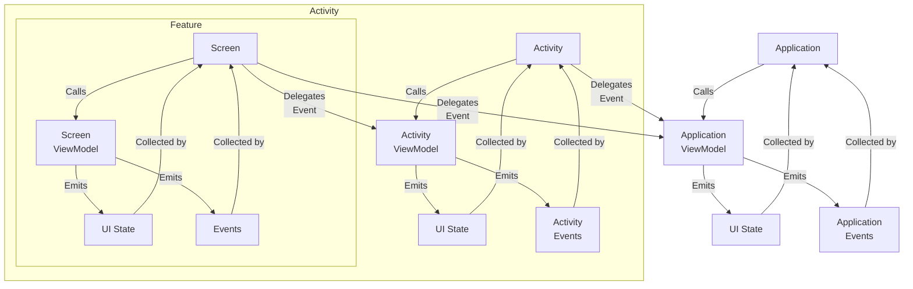

# Compose Feature Architecture

```mermaid
flowchart
    APPLICATION[Application]
    APPLICATION_UI_STATE[UI State]
    APPLICATION_EVENTS[Application\nEvents]
    APPLICATION_VM[Application\nViewModel]

    ACTIVITY[Activity]
    ACTIVITY_UI_STATE[UI State]
    ACTIVITY_EVENTS[Activity\nEvents]
    ACTIVITY_VM[Activity\nViewModel]

    SCREEN[Screen]
    SCREEN_UI_STATE[UI State]
    SCREEN_EVENTS[Events]
    SCREEN_VM[Screen\nViewModel]

    APPLICATION -->|Calls| APPLICATION_VM
    APPLICATION_UI_STATE -->|Collected by| APPLICATION
    APPLICATION_EVENTS -->|Collected by| APPLICATION
    APPLICATION_VM -->|Emits| APPLICATION_EVENTS
    APPLICATION_VM -->|Emits| APPLICATION_UI_STATE

    subgraph Activity
        ACTIVITY -->|Calls| ACTIVITY_VM
        ACTIVITY_UI_STATE -->|Collected by| ACTIVITY
        ACTIVITY_EVENTS -->|Collected by| ACTIVITY
        ACTIVITY_VM -->|Emits| ACTIVITY_EVENTS
        ACTIVITY_VM -->|Emits| ACTIVITY_UI_STATE

        subgraph Feature
            SCREEN -->|Calls| SCREEN_VM
            SCREEN_UI_STATE -->|Collected by| SCREEN
            SCREEN_EVENTS -->|Collected by| SCREEN
            SCREEN_VM -->|Emits| SCREEN_EVENTS
            SCREEN_VM -->|Emits| SCREEN_UI_STATE
        end
    end

    SCREEN -->|Delegates\nEvent| APPLICATION_VM
    SCREEN -->|Delegates\nEvent| ACTIVITY_VM
    ACTIVITY -->|Delegates\nEvent| APPLICATION_VM
```